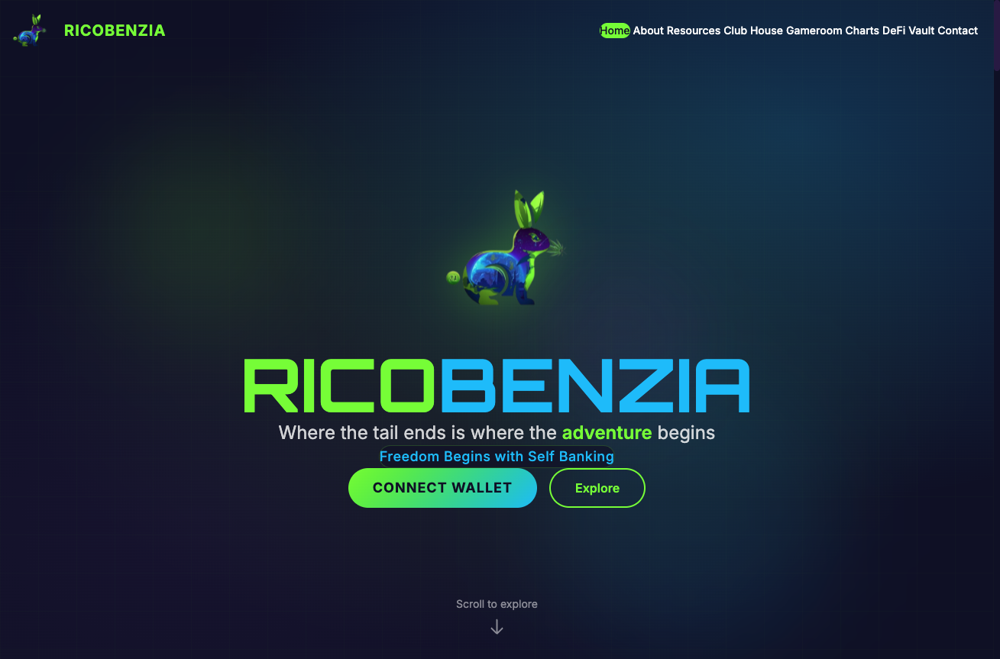
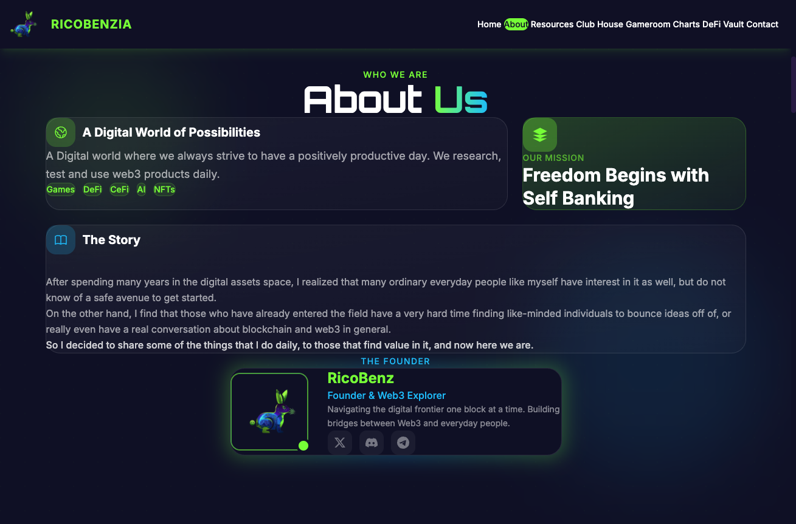
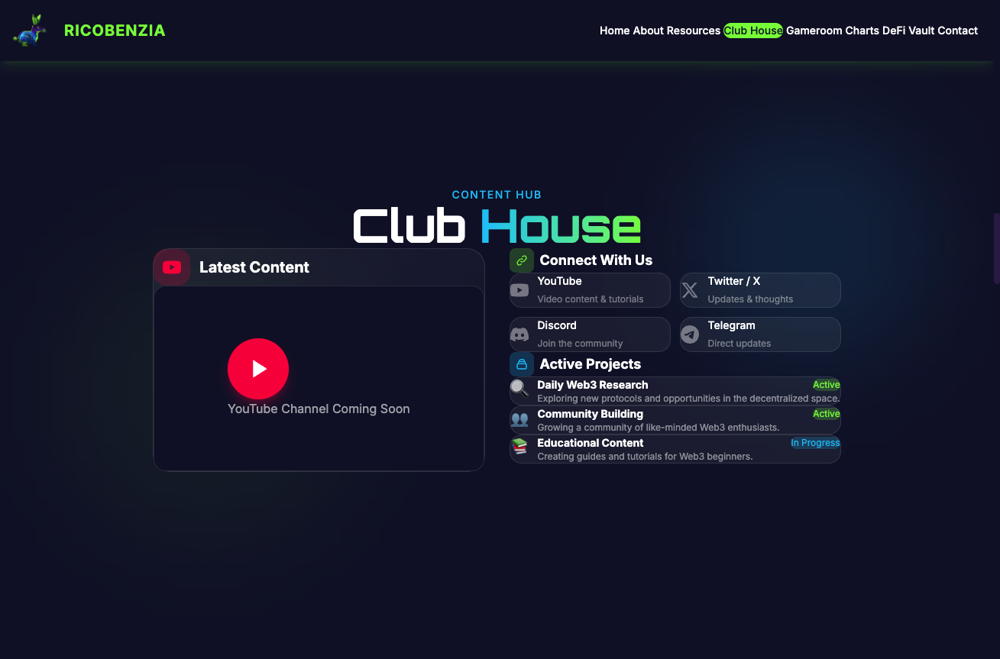
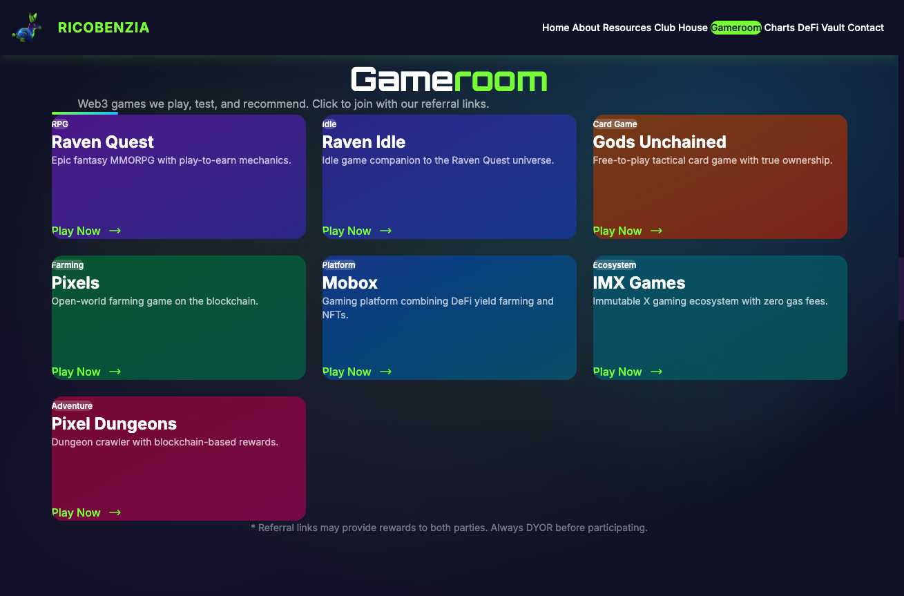
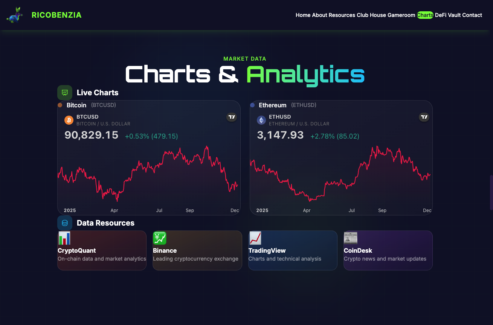
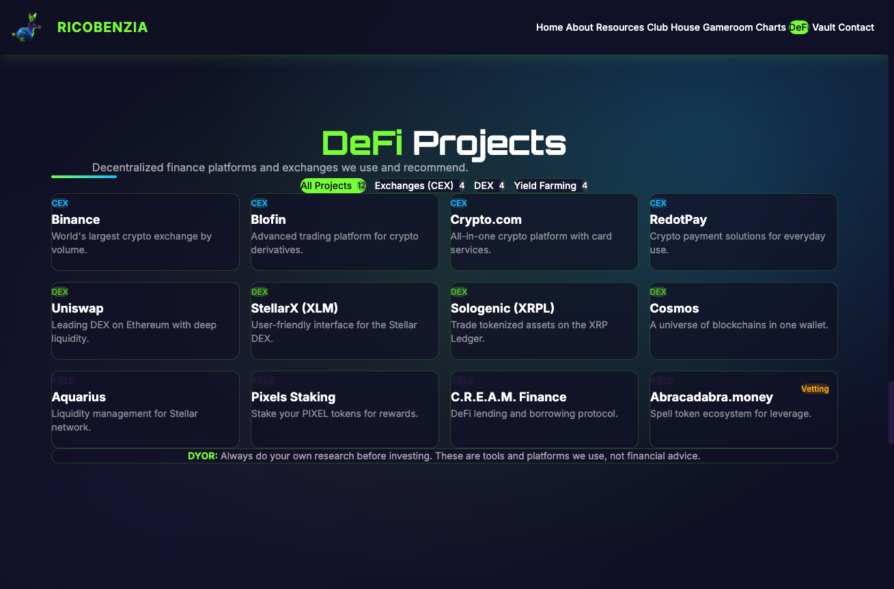
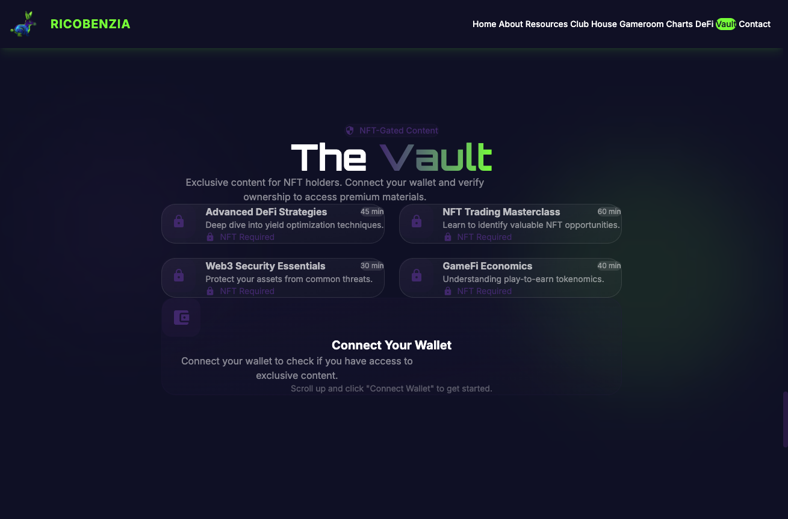

# RicoBenzia Web3 Portal

> "Where the tail ends is where the adventure begins"

A modern, single-page Web3 portal for exploring DeFi, games, and blockchain content. Built with React, TypeScript, and featuring wallet integration via RainbowKit.


## 🌐 Live Demo

Coming soon at [ricobenzia.com](http://ricobenzia.com)

---

## 📸 Screenshots

### Hero Section


### About Us


### Club House


### Gameroom


### Charts & Analytics


### DeFi Projects


### The Vault (NFT-Gated)


---

## ✨ Features

### Core Functionality
- **Single-page design** with smooth scroll navigation
- **Wallet connection** via RainbowKit (MetaMask, WalletConnect, Coinbase, etc.)
- **NFT-gated content** system (ready for contract integration)
- **Live market data** with TradingView chart embeds
- **Responsive design** for mobile, tablet, and desktop

### Sections
| Section | Description |
|---------|-------------|
| **Hero** | Landing with logo, slogan, and wallet connect |
| **About** | Mission, story, and founder info |
| **Resources** | Educational materials and guides |
| **Club House** | Social links and active projects |
| **Gameroom** | Web3 games with referral links |
| **Charts** | Live BTC/ETH charts + data resources |
| **DeFi** | CEX, DEX, and yield farming projects |
| **Vault** | NFT-gated premium video content |
| **Contact** | Contact form and social links |

---

## 🛠️ Tech Stack

- **Framework:** React 19 + TypeScript
- **Build Tool:** Vite
- **Styling:** Tailwind CSS v4
- **Animations:** Framer Motion
- **Wallet:** RainbowKit + wagmi + viem
- **Charts:** TradingView Widgets
- **Network:** Polygon (pre-configured)

---

## 🚀 Getting Started

### Prerequisites
- Node.js 18+
- npm or yarn

### Installation

```bash
# Clone the repository
git clone https://github.com/salutethegenius/ricobenzia_home.git
cd ricobenzia_home

# Install dependencies
npm install

# Start development server
npm run dev
```

The app will be available at `http://localhost:5173`

### Build for Production

```bash
npm run build
```

Output will be in the `dist/` folder.

---

## 📁 Project Structure

```
ricobenzia/
├── public/
│   ├── assets/           # Logo and images
│   └── screenshots/      # README screenshots
├── src/
│   ├── components/
│   │   ├── Navbar.tsx    # Navigation with smooth scroll
│   │   ├── Hero.tsx      # Landing section with wallet connect
│   │   ├── About.tsx     # About, mission, team
│   │   ├── Resources.tsx # Educational resources
│   │   ├── ClubHouse.tsx # Social links, YouTube, projects
│   │   ├── Gameroom.tsx  # Web3 games grid
│   │   ├── Charts.tsx    # TradingView embeds
│   │   ├── DeFi.tsx      # DeFi project listings
│   │   ├── GatedVault.tsx# NFT-gated content
│   │   ├── Contact.tsx   # Contact form
│   │   └── Footer.tsx    # Footer with disclaimer
│   ├── hooks/
│   │   └── useNFTGate.ts # NFT ownership verification
│   ├── App.tsx           # Main app with disclaimer modal
│   ├── main.tsx          # Entry point with providers
│   └── index.css         # Tailwind + custom styles
├── index.html
├── tailwind.config.js
├── vite.config.ts
└── package.json
```

---

## 🎨 Design System

### Color Palette
| Token | Hex | Usage |
|-------|-----|-------|
| `cosmic-purple` | `#2D1B4E` | Headers, deep backgrounds |
| `electric-blue` | `#00BFFF` | Accents, glows |
| `vibrant-green` | `#7CFC00` | CTAs, highlights |
| `space-dark` | `#0D0D2B` | Primary background |
| `clean-white` | `#FFFFFF` | Text on dark |

### Typography
- **Display:** Orbitron (headings)
- **Body:** Inter (content)

---

## 🔐 NFT Gating (Future)

The vault section is prepared for NFT-gated content. To enable:

1. Deploy your NFT contract on Polygon
2. Update the contract address in `src/hooks/useNFTGate.ts`
3. Implement the balance check using wagmi's `useReadContract`

---

## 📱 Responsive Breakpoints

- **Mobile:** < 640px
- **Tablet:** 640px - 1024px
- **Desktop:** > 1024px

---

## 🔗 External Integrations

- **TradingView** - Live chart widgets
- **RainbowKit** - Wallet connection
- **Polygon** - Default network

---

## 📄 Legal

This website is for **educational and entertainment purposes only**. Nothing constitutes financial, investment, legal, or tax advice. Always DYOR.

---

## 🤝 Contributing

This is a private project. For inquiries, contact via the website.

---

## 📜 License

All rights reserved © 2025 RicoBenzia

---

**Mission:** Freedom Begins with Self Banking
